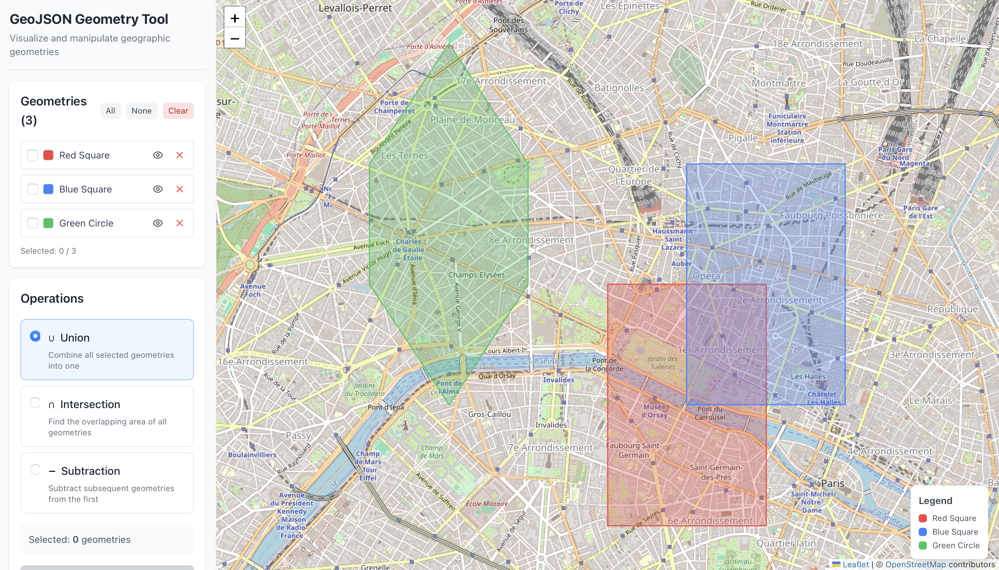
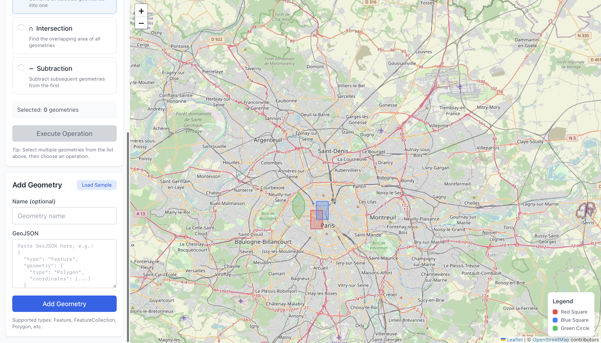

GeoJSON Geometry Tool

A small web application for visualizing and performing geometric operations on GeoJSON data using an interactive map.

The project demonstrates how geographic geometries can be loaded, visualized and combined through common spatial operations.

⸻

## Screenshots
### Application interface

### Example with loaded geometries

⸻

Project Context

This project was developed as part of a technical exercise inspired by real-world problems involving geographic data processing.

The objective was not to build a production-ready system, but to demonstrate:
	•	project structure
	•	technical decision making
	•	ability to work with geospatial data
	•	clear documentation of the development process

The application allows users to load GeoJSON geometries, visualize them on a map and apply geometric operations such as union, intersection and subtraction.

⸻

Tech Stack

Frontend framework
	•	React 18

Build tool
	•	Vite

Mapping library
	•	Leaflet
	•	React-Leaflet

Geospatial processing
	•	turf.js

Styling
	•	Tailwind CSS

⸻

Features Implemented

Interactive map
	•	Displays geometries on an OpenStreetMap base map
	•	Automatically adjusts bounds to visible geometries

GeoJSON loading
	•	Paste GeoJSON directly into a form
	•	Basic validation before rendering

Geometry management
	•	Toggle geometry visibility
	•	Remove geometries
	•	Select multiple geometries

Geometric operations
	•	Union
	•	Intersection
	•	Subtraction

Operation results are added as new geometries and displayed on the map.

Sample geometries are included for testing.

⸻

Application Architecture

The application follows a simple component-based architecture.

Main components:

MapView
Responsible for rendering the Leaflet map and displaying geometries.

GeometryList
Displays all loaded geometries and provides selection controls.

GeometryForm
Handles input and validation of GeoJSON data.

OperationPanel
Allows the user to perform geometric operations between selected geometries.

State management is handled through a custom React hook (useGeometries) that centralizes geometry storage and operations.

Geometric calculations are implemented using turf.js.

⸻

Project Structure
src/
├── components/
│   ├── MapView.jsx
│   ├── GeometryList.jsx
│   ├── GeometryForm.jsx
│   └── OperationPanel.jsx
├── hooks/
│   └── useGeometries.js
├── utils/
│   ├── geometryOps.js
│   └── sampleData.js
├── App.jsx
└── main.jsx

Getting Started

Requirements

Node.js 18+
npm or yarn

⸻

Installation

Clone the repository
git clone <repository-url>
cd geojson-geometry-tool

Install dependencies
npm install

Run development server
npm run dev

The application will be available at
http://localhost:5173

sage

Add geometries
	1.	Paste valid GeoJSON into the input field
	2.	Optionally give the geometry a name
	3.	Click Add Geometry

Perform operations
	1.	Select two or more geometries
	2.	Choose an operation
	3.	Execute the operation

The result will appear as a new geometry on the map.

⸻

Technical Decisions

Leaflet

Leaflet was selected because it provides a lightweight and well-documented solution for interactive maps. The React-Leaflet wrapper integrates cleanly with React components.

turf.js

turf.js provides reliable implementations of common spatial operations such as union and intersection. It is widely used for geospatial analysis in JavaScript environments.

Tailwind CSS

Tailwind was used to speed up UI development and avoid writing custom CSS while keeping components readable.

Textarea instead of file upload

GeoJSON input was implemented as a textarea to simplify testing and allow quick copy/paste of geometries from other tools or APIs.

⸻

Challenges Encountered

Leaflet CSS loading

The map initially rendered incorrectly because Leaflet styles were not loaded properly. This was resolved by explicitly importing the Leaflet CSS file.

turf.js API changes

Some turf.js functions have changed across versions. The implementation was updated to match the current API of the @turf/turf package.

GeoJSON validation

GeoJSON supports many geometry types and structures. A simple validation approach was implemented by checking required properties and attempting basic geometry calculations.

⸻

Limitations

This project focuses on demonstrating geospatial operations rather than building a complete GIS tool.

Current limitations include:
	•	geometries can only be pasted manually
	•	no editing directly on the map
	•	limited validation of GeoJSON structures
	•	no persistence of application state

⸻

Possible Improvements

File upload support for GeoJSON files

Export operation results as GeoJSON

Draw and edit geometries directly on the map

Undo / redo for operations

Saving and loading project state

Additional spatial operations (buffer, simplify, convex hull)

⸻

License

This project is provided for educational and demonstration purposes.